# microdrone-world-model

> **A tiny latent world-model stack for micro-drones: action-conditioned
> prediction, proactive collision avoidance, and sim-to-real evaluation under
> embedded constraints.**

**Status: v0.8.0 — indoor search goes vertical (yaw + altitude + geometric
height), and one embedded WM pair flies two modes.** The baseline shipped as
[Lesson 29 of the nanodrone-ai course](https://github.com/csinghans/nanodrone-ai/tree/main/lessons/29_world_model);
this repo re-homes it as a clean research package and re-ran the entire
pipeline from scratch — twice — to separate what reproduces from what
varies with the training draw. See the two-tier benchmark below: the
*mechanisms* reproduce every time; the *point numbers* carry honest
run-to-run ranges.

## Why this exists

Big world models (V-JEPA 2 class) need Orin-class GPUs. A 27 g drone has a
512 KB budget and a ~10 ms decision deadline. This project's wedge is the
gap between those two sentences: **how much anticipation can you buy under
embedded constraints?** See [docs/vision.md](docs/vision.md).

## The stack

```
camera frame ──> Encoder (bearing-aware, 64-d latent)
                   │
       candidate ──┤  MultiPredictor: z + Δk(z, a)  (k = 4/8/16/32 steps)
       commands    │
                   └─> CollisionHeads: P(warn 0.7 m), P(crit 0.35 m) per horizon
                                │
             planner reads the futures: latent MPC (hand) or PPO (learned)
```

| layout | what lives there |
|---|---|
| `world_model/` | encoder, predictor, collision heads, JEPA losses, training loop |
| `planner/` | action set, hand latent-MPC + reactive baseline, learned policies, safety filter |
| `sim/` | 48 Hz Crazyflie-class env + PID velocity commander, scenarios, domain randomization |
| `datasets/` | intervention rollouts, counterfactual label oracle + FOV honesty masks |
| `eval/` | timing schematic, closed-loop scoreboard, speed sweep, robustness pricing, embedded budget |
| `scripts/` | `train.py`, `evaluate.py`, `demo.py` |
| `hardware/` | v0.4 bridge design (Tello off-board → Crazyflie/GAP8 on-board) |

## Quickstart

**New here?** The verified one-hour path — environment, your first
measurement, your first campaign — is
[docs/ONBOARDING.md](docs/ONBOARDING.md)（繁體中文導覽：
[docs/START-HERE.zh-TW.md](docs/START-HERE.zh-TW.md)）. Graded
starter ideas: [docs/RESEARCH-IDEAS.md](docs/RESEARCH-IDEAS.md).

```bash
conda env create -f environment.yml
conda activate microdrone-wm
pip install --no-deps git+https://github.com/utiasDSL/gym-pybullet-drones.git
pip install -e .

python -m datasets.generate_rollouts --rollouts 64   # 1. fly the data
python -m scripts.train --epochs 80                  # 2. train the world model
python -m scripts.demo                               # 3. one-course demo + plot
python -m eval.eval_closed_loop --seeds 100          # 4. the scoreboard
python -m eval.eval_speed_sweep --seeds 30           # 5. crash rate vs speed
python -m scripts.train --policy --timesteps 300000  # 6. learn the policy
python -m scripts.evaluate --seeds 60                # 7. every policy, same courses
```

Every module has a `--selftest` (or `python -m <module>`) that prints an
`XXX OK` line and asserts it.

## Flight skills: the autonomous research loop

New capabilities are **plugins** under `skills/` — each declares its own
scenarios, pre-registered targets, regression guards and an ordered knob
schedule — and one command runs the whole research loop (train → fly →
gate → next knob) until the targets pass or the budget runs out:

```bash
python -m scripts.research skills/gap_flight     # the full campaign
python -m scripts.research status skills/gap_flight
```

Every gate appends its numbers to `experiments/<skill>/journal.md`, updates
`results.json`, rechecks borderline cells at n=60 on fresh seeds, and
commits — the same measured discipline the repo's own campaigns were run
with, encoded. (The vocabulary — knobs, gates, bars, guards, draws — is
defined with live examples in [docs/GLOSSARY.md](docs/GLOSSARY.md).) Agent-driven research uses the step mode plus the
`/research` command (`.claude/commands/research.md`): the runner stays
deterministic; the judgment between gates is the researcher's job. First
skill in the catalog: **gap-flight** (transit a 0.55-0.85 m opening in a
fence — the two-ring collision head's real exam), and its first campaign
already ran itself to a pass: zero-shot 27 % → 87-90 % success with all
guards green, in three gates (`experiments/gap_flight/journal.md`).

## Results at a glance

Five arc figures carry the repo's headline findings; every number is a
gated campaign record, failures drawn as prominently as wins. Per-skill
gate charts (every criterion vs its frozen bar, knob by knob) live in
[docs/figures/](docs/figures/); everything regenerates mechanically
from the committed `results.json` files via
`python -m eval.eval_results_figures`.

**The slalom wall, and how it fell — twice.** Five RL knob families
(diet, budget, rhythm, horizon, reward) and two fine-tune attempts
never got the three-gate chain off the floor; behavior cloning a
privileged scripted pilot cleared the probe-priced bar in one shot —
on courses the clone never saw. The last bar is the eleventh sitting:
the first artifact to hold the chain AND every guard (pooled n=120,
anchored-schedule fine-tune + edge-biased diet) — the skill's crown:

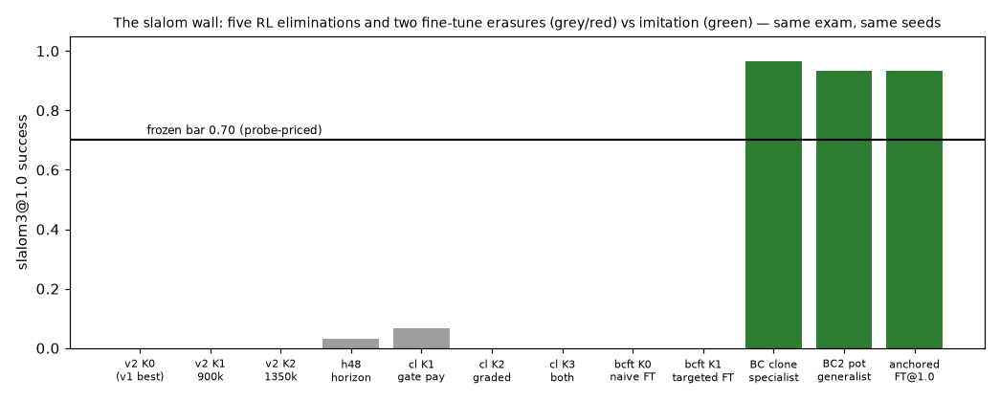

**Fine-tune safety, measured.** From a five-skill BC prior, naive PPO
repairs the weak skills and erases the chain — and the erasure is
FASTER than the repair (dead inside 25k steps), so early stopping
cannot help. A KL anchor to the frozen prior decouples: chain intact,
gap repaired past its bar. The deeper mgap drift needs more movement
than a constant kl=1.0 permits — a SCHEDULED anchor (1.0 → 0.1,
diamonds) buys it: early tightness carries the chain through the
period when re-optimization is fiercest, late freedom finishes the
repair. Two limits are measured, not assumed: anchor pressure is
mass-weighted (thin diet slices corrode almost as if naked), and
anchors defend against drift, not against reward (a station economy
opposed by the diet majority's progress reward was erased through a
relaxing anchor):

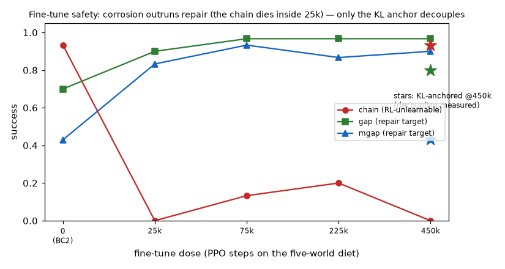

**Dodgeball: the speed curve inverts under imitation.** RL's success
falls with ball speed; the clone's rises (brief threats convert its
0.898 dodge-decision accuracy directly) — the fastest cell is the
catalog's only fast-ball bar pass:

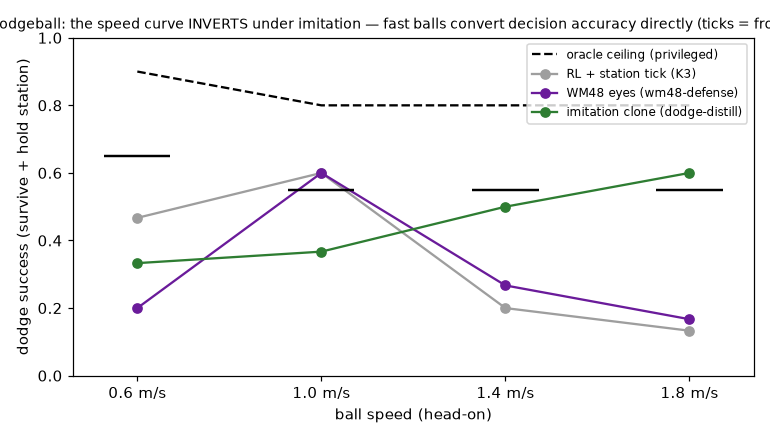

**Teacher → student → fine-tune, three lines at n=200.** Imitation
buys the skill (open-loop val 0.908 → closed-loop 58.5 %: the 30-point
drift tax, quantified), on-policy RL buys the robustness back — and
ties the teacher:

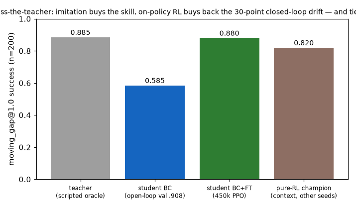

**And what the flights look like.** Per-arena champion trajectories on
the exact exam seeds the gates graded (small multiples, each panel its
own course; green/red = the skill's own predicate) live in the same
folder — `traj_*.png` via `python -m eval.eval_skill_gallery`. The
chain, visibly chained:

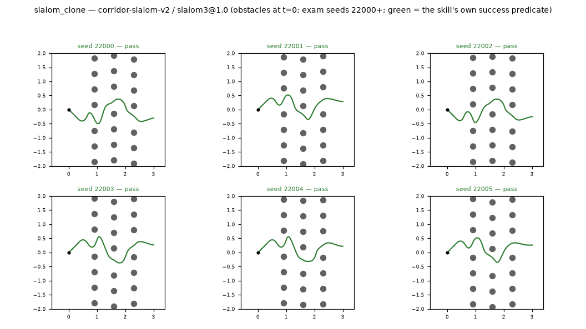

**Indoor active search: what a monocular world model is, and is NOT, for.**
A separate track (2D translational roaming, enclosed rooms, an abstract
beacon) put the world model to three indoor jobs and gated each honestly:

| job | world-model result | who wins |
|---|---|---|
| collision safety | flat walls are scale-free; blind to side/behind | a cheap 4–8-beam rangefinder ring |
| coverage (where to go) | HURTS under clutter vs a plain grid | geometric Frontier / grid policy |
| **detection (is a target in view)** | **AUC 0.94, target-specific, no retrain** | **the world model** |

It loses the spatial jobs to cheap geometry but perception is its home.
Single- and multi-room search is deployable, crash-free, on the
rangefinder ring — the doorway crossing visible in a god-view sweep:

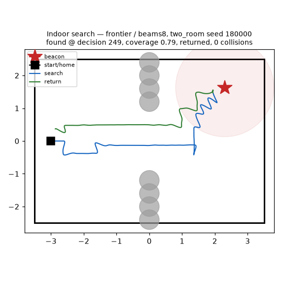

**The camera-lock that capped it — broken, cheaply.** The track's recurring
limit was the yaw=0 forward camera (it blinded the WM to 60 % of residual
collisions AND let visual search only glimpse a target sweeping past). v0.8
lifts it *for perception* with **no WM retrain**, because the frozen latent
is a function of the image: detection is yaw-INVARIANT (pooled AUC 0.977) and
survives altitude with a retrained head. So the drone can now **turn to find**
(hover-yaw-scan flight gate: correct 0.70, false-alarm 0.10, crash 0.00) and
**search in the vertical** — fly to a target's height and look level (vz, a
clean DOF, not pitch): a multi-height scan lifts find-rate **0.50 → 1.00**,
catching both the high cabinet (2.0 m, outside a level FOV at cruise) and the
under-bed target (0.3 m). Height itself is cheap geometry — an upward
rangefinder reads ceiling clearance at 0.0 cm MAE — and near-floor flight is
clean in sim (the honest remaining limit there is sim-to-real near-surface
aero, not control). Only flight-*while*-turning avoidance (body≠world) still
awaits a WM retrain; indoor avoidance stays the beams8 ring's job.
(`experiments/{yaw,alt,height,lowfly}_v1/`)

## One embedded pair, two flight modes

A *unified* world model (trained on the union of transit + indoor rollouts)
matches-or-beats the specialist on every job the WM directly owns — transit
collision-prediction and indoor detection — but overwriting the pinned
champion breaks the distilled skill zoo (slalom 80 %→0 %; the encoder shift
compounds over its ~40-decision chain). So the unified WM ships **alongside**
the champion, not over it: a flight mode set at start binds each mission to
its own stack (`planner/flight_mode.py`), two WMs resident at ~163 KB int8
(32 % of the 512 KB budget), only one running per mode.

```bash
python -m scripts.fly --mode transit        # pinned champion WM + skill policy
python -m scripts.fly --mode indoor_search  # unified WM + frontier + beams8
```

| `transit` (pillar avoidance) | `indoor_search` (find + return) |
|---|---|
| 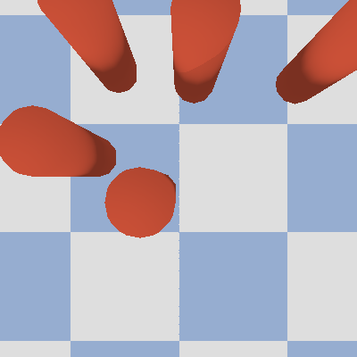 | 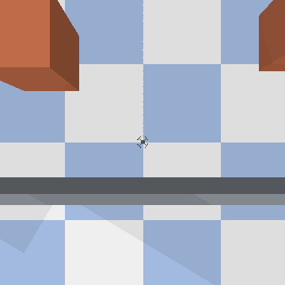 |

(Whether a swap-broken skill can be *retrained* to survive the unified WM was
measured too: a post-hoc hover wrapper fails, stop-aware training recovers
slalom 0 %→25 %, and two-WM encoder data-augmentation is the strongest lever
at 0 %→75 % — `experiments/slalom_stopobserve_v1/`.)

## Flight TDD: the integration layer

Unit tests are the skill cells; the **integration test** is a randomly
composed 3-stage course flown end to end (`docs/TDD-FLIGHT.md`). The
**deployment gate** — the standing precondition for real hardware — is
integration success ≥ 0.70 at n = 100 random courses.

Current state: **GREEN — 72/100 (2026-07-07).** The winning entry is
the flight-plan hybrid: a course-fine-tuned generalist flies four
stage types (0.86-1.00 conditionals) and a big-pot slalom specialist
(43k demonstrations, val 0.963 — the fidelity a 40-decision chain
demands) flies the fifth, with mission-plan handoffs. The climb, each
step built from the previous lineup's failure histogram:

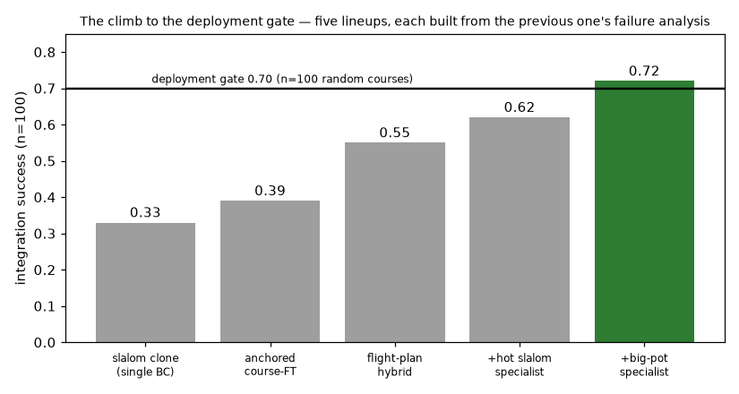

The videos of record, from passing seed 110004
(slalom → opening door → moving gap):

| drone FPV | simulator god view |
|---|---|
| 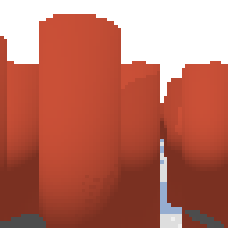 | 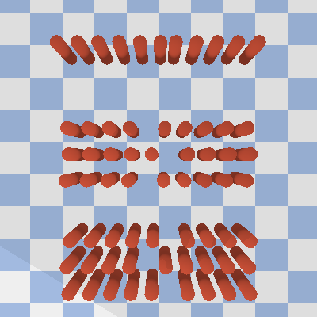 |

## The benchmark, two tiers (course draw + two fresh from-scratch draws here)

**Tier 1 — mechanisms: reproduced on every draw.**

| claim | course | draw 1 | draw 2 |
|---|---|---|---|
| "which way to dodge is safer" (veer-ranking, chance 0.5) | **1.00** | **1.00** | **1.00** |
| whole stack: weights + activations + workspace | **137.3 KB**, ~8 ms/decision | 137.3 KB | 137.3 KB |
| reactive collapses with speed (crash @1.6 m/s) | 60 % | 63 % | 57 % |
| the world model holds at speed (crash @1.6 m/s) | 10 % | 20 % | 10 % |
| anticipation triggers earlier (mean lead, cluttered) | +243 ms | — | +193 ms |
| false evasions on clear courses | 0 % | 0 % | 0 % |
| robust retrain never hurts the shifted AUC | ✔ | ✔ | ✔ |

**Tier 2 — point numbers: honest run-to-run ranges.**

| quantity | course draw | fresh draws here | note |
|---|---|---|---|
| collision AUC @667 ms (val split) | 0.96 | 0.92 / 0.85 (0.89–0.93 on held-out sets) | tracks the training draw and the val split |
| hand-MPC cluttered crash tail | 16 % | 10 % / 9 % | the FOV/memory limit, always present |
| learned policy, 0.8–1.6 m/s sweep | **0 % everywhere** | 0–30 % per band | the all-zero result came from a strong-model draw; policy quality tracks world-model quality |
| priced appearance gap (clean → shifted AUC) | 0.96 → 0.82 | ≤ 0.02 drop | gap size tracks how appearance-overfit the clean model is; the buy-back direction held everywhere |

The split is the point: **claims about mechanisms survive retraining;
claims about the third decimal do not.** Single-draw numbers (including the
course's) should be read with that in mind — this repo publishes both tiers
so nobody has to take a best run's word for it.

Also inherited and kept honest: the four-run memory-architecture study
(stacked vs LSTM vs edge-biased diet vs curriculum — the stack never lost
anywhere; re-weighting moves the hole; ordering isn't consolidation).

## Roadmap

The living roadmap — open items, the mechanism map of the dense
frontier, instrument notes, and the hardware unfreeze criteria — lives
in [docs/ROADMAP.md](docs/ROADMAP.md). The shipped arc:

- **v0.1 — the port**: clean package, claims reproduced (two-tier table
  above). *(done)*
- **v0.2 — harder worlds, three axes** *(done)*: dense clutter + an aimed
  moving crosser, attacked with motion-aware labels (the oracle stops lying
  about motion — a crossing pillar is now detectable), a model-side GRU
  (honest negative: it helped exactly where memory was not the constraint),
  and a hard-diet policy retrain (the win: moving crash 83 % → **33 %**,
  cluttered **0 %**, best-or-tied everywhere). Dense clutter remains the
  stated open frontier (~37-50 %) — the FOV/memory hole survives. Full gate
  numbers in the CHANGELOG.
- **v0.3 — the dense hole** *(done)*: an odometry "map pin" (own corridor
  progress in each observation step — the anchor that turns a stacked
  history into a registrable map) plus the edge-biased diet: dense
  37-50 % → **17-27 %**, moving 13/**7 %**, home sweep 0/0/0/0/3 %. One
  scalar and a diet beat architecture, again. Metric grounding (offline
  4D-GS) moves to v0.5.
- **v0.4 — the research loop becomes a program** *(done)*: scenario
  registry, flight-skill plugins, the autonomous gate runner + `/research`
  charter — and the first self-run campaign (gap-flight: 27 % → 87-90 %
  with guards green).
- **v0.5 — metric grounding, a split verdict** *(done, honestly)*: a
  train-only polar-occupancy aux (the offline-4D-GS perfect-reconstruction
  upper bound, zero deploy cost) buys **+0.07..+0.24 dense AUC** and lifts
  every model-layer metric — and the policy retrained on it flies dense
  **worse** (17 % → 37 % @0.8). The fourth confirmation of the house
  refrain, now through a full policy retrain: a better detector is not a
  better flight. Full gates: `experiments/metric_grounding/journal.md`.
- **v0.6 — hardware bridge (parked)**: Tello (off-board, honest about it)
  → Crazyflie + AI-deck (GAP8, truly on-board). See [hardware/](hardware/).

## Safety boundary

This project is for safety-focused autonomous navigation, collision
avoidance, education, and research. It does not support weaponization,
surveillance abuse, or evasion of safety/legal constraints. All flight
demos carry a geofence, manual override, emergency land, low-battery
behaviour, log replay, and a field-test checklist —
[docs/safety.md](docs/safety.md).

## Writing

Long-form articles (English + 繁體中文), every number traceable to a
script here: [writing/](writing/) — starting with
[*Why micro-drones need tiny world models*](writing/01-why-tiny-world-models/en.md).

## Origins

Grew out of [nanodrone-ai](https://github.com/csinghans/nanodrone-ai) — a
30-lesson bilingual course that ends where this repo begins. 繁體中文的入門
導讀請從課程的[從這裡開始](https://github.com/csinghans/nanodrone-ai/blob/main/docs/zh-TW/START-HERE.md)出發。

Licensed under [Apache-2.0](LICENSE) (see [NOTICE](NOTICE) for provenance).
