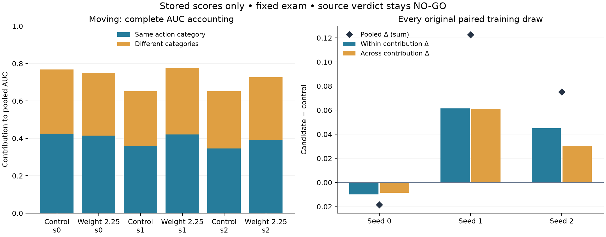

# Action-pair AUC audit — source study remains NO-GO

Generated from the six saved `executed_weight_v1` score exports.
No fitting, model inference, new courses, bootstrap or changed verdict.

An AUC compares positive and negative windows. The matrix groups each
comparison by both windows' executed action categories. Diagonal cells
compare the same category; off-diagonal cells compare different categories.
Both contributions are weighted by their share of all score pairs.

## Comparison support

| World | Windows | Courses | Positive / negative | Same-action pair share |
|---|---:|---:|---:|---:|
| classic | 2896 | 42 | 993 / 1903 | 52.40% |
| dense | 2879 | 42 | 2558 / 321 | 58.93% |
| moving | 2989 | 42 | 1680 / 1309 | 53.97% |

## classic: every paired seed

Control = unit weight; candidate = moving weight 2.25.

| Seed | Pooled Δ | Within contribution Δ | Across contribution Δ | Within AUC control → candidate | Across AUC control → candidate |
|---|---:|---:|---:|---:|---:|
| 0 | -0.019091 | -0.008686 | -0.010404 | 0.8037 → 0.7872 | 0.8493 → 0.8275 |
| 1 | +0.025196 | +0.011587 | +0.013609 | 0.7881 → 0.8102 | 0.8041 → 0.8326 |
| 2 | +0.088096 | +0.056708 | +0.031389 | 0.6957 → 0.8040 | 0.7793 → 0.8453 |

Three-draw mean: pooled +0.031401 = within +0.019870 + across +0.011531.

| Action | Positive / negative windows | Positive / negative courses |
|---|---:|---:|
| forward | 692 / 1380 | 13 / 33 |
| slow | 27 / 101 | 3 / 7 |
| veer_left | 134 / 156 | 8 / 9 |
| veer_right | 69 / 33 | 3 / 2 |
| climb | 19 / 84 | 2 / 5 |
| hover | 52 / 149 | 3 / 11 |

## dense: every paired seed

Control = unit weight; candidate = moving weight 2.25.

| Seed | Pooled Δ | Within contribution Δ | Across contribution Δ | Within AUC control → candidate | Across AUC control → candidate |
|---|---:|---:|---:|---:|---:|
| 0 | +0.012327 | +0.015074 | -0.002747 | 0.8078 → 0.8334 | 0.7424 → 0.7357 |
| 1 | -0.029346 | -0.013548 | -0.015798 | 0.8250 → 0.8020 | 0.7655 → 0.7270 |
| 2 | +0.076581 | +0.044682 | +0.031899 | 0.7546 → 0.8304 | 0.6856 → 0.7633 |

Three-draw mean: pooled +0.019854 = within +0.015403 + across +0.004451.

| Action | Positive / negative windows | Positive / negative courses |
|---|---:|---:|
| forward | 1849 / 257 | 33 / 16 |
| slow | 82 / 11 | 7 / 1 |
| veer_left | 134 / 0 | 9 / 0 |
| veer_right | 227 / 7 | 12 / 1 |
| climb | 168 / 24 | 9 / 1 |
| hover | 98 / 22 | 6 / 2 |

## moving: every paired seed

Control = unit weight; candidate = moving weight 2.25.

| Seed | Pooled Δ | Within contribution Δ | Across contribution Δ | Within AUC control → candidate | Across AUC control → candidate |
|---|---:|---:|---:|---:|---:|
| 0 | -0.018403 | -0.009985 | -0.008417 | 0.7877 → 0.7692 | 0.7463 → 0.7280 |
| 1 | +0.122691 | +0.061576 | +0.061115 | 0.6663 → 0.7804 | 0.6349 → 0.7676 |
| 2 | +0.075187 | +0.044918 | +0.030269 | 0.6411 → 0.7244 | 0.6642 → 0.7299 |

Three-draw mean: pooled +0.059825 = within +0.032170 + across +0.027656.

| Action | Positive / negative windows | Positive / negative courses |
|---|---:|---:|
| forward | 1230 / 937 | 24 / 33 |
| slow | 75 / 67 | 6 / 4 |
| veer_left | 144 / 48 | 8 / 4 |
| veer_right | 20 / 46 | 3 / 4 |
| climb | 115 / 67 | 6 / 5 |
| hover | 96 / 144 | 5 / 8 |

## Interpretation limits

The contribution split is an exact accounting identity on this fixed exam.
Within-category comparisons still mix speeds, courses and geometry; across-
category comparisons can contain useful scene information. Neither part alone
establishes action memorization, causal perception, or a flight capability.
Course counts may overlap across actions/classes. Windows and their pair
products are not independent trials; no new confidence interval is claimed.
Empty pair cells have null AUC in the complete [JSON matrices](report.json).
The original failed seed and guards remain NO-GO. No candidate is promoted.
