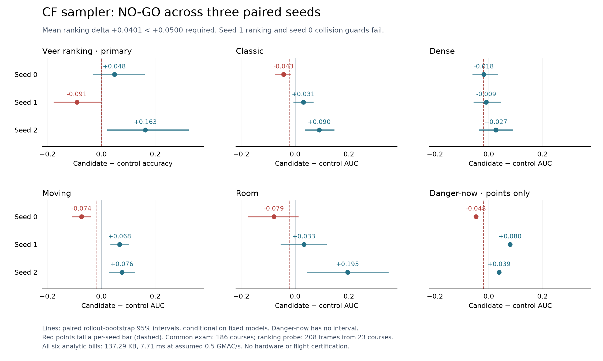

# cf_hard_pool_v1 — NO-GO

Generated by `python -m eval.eval_cf_sampler_report` from the saved
[raw report](records/report.json) and individual receipts. No new
training, scoring or resampling. [Frozen registration](registration.json).

The sole knob is the CF hard-pool rule: `legacy_masked` control versus
`answerable` candidate. Six fresh 80-epoch fits share the same hashed
192-rollout training corpus, with matched seeds 0/1/2 and identical
within-pair splits, executed windows and optimizer steps. D64, four
strips, 64px, one frame. Every model scores the same new 186-course
exam (12,147 overlapping valid windows).

Mean veer delta **+0.0401**, below the registered
**+0.0500** minimum. Seed 1 also regresses
in ranking; seed 0 fails classic, moving, room and danger-now guards.
A favorable mean or seed 2 cannot override those per-seed failures.
The default remains `legacy_masked`; no candidate is promoted.

## Primary: action ranking

| Seed | Control | Candidate | Delta | Paired course-bootstrap 95% interval |
|---|---:|---:|---:|---:|
| 0 | 0.8510 | 0.8990 | +0.0481 | [-0.0290, +0.1579] |
| 1 | 0.8606 | 0.7692 | -0.0913 | [-0.1752, -0.0046] |
| 2 | 0.5817 | 0.7452 | +0.1635 | [+0.0239, +0.3216] |

Each reading has **208 probe frames from 23 independent courses**, exceeding the registered
20-frame / six-course support bars. Frames within a course are correlated.
The three-draw mean/range describes these training draws, not a
training-population confidence interval. Paired, world-stratified
rollout-bootstrap intervals (2,000 draws, seed 0) condition on each
fixed model pair. They are descriptive; they do not change the gates.
The stored gate uses float32 mean accuracy; exported boolean means
use float64. They agree within 1e-7 and give the same displayed values.

A post-hoc [support accounting](probe_support.json), with unchanged
eligibility, reconciles all six hashed exports:

| Probe world | Frames | Independent courses |
|---|---:|---:|
| classic | 39 | 6 |
| dense | 145 | 15 |
| moving | 24 | 2 |
| room | 0 | 0 |

The pooled primary is dominated by dense frames; moving contributes
only two independent probe courses and the pillar-kinematic probe
does not cover room geometry. This limits interpretation of ranking
by world. It does not invalidate the pre-registered pooled support
bar or permit expanding the completed exam. All four worlds still
have their separately guarded collision AUC on the full exam.

## Every collision guard, every seed

Candidate minus control AUC. **Bold** fails the frozen −0.02 guard.

| Seed | Classic | Dense | Moving | Room | Danger-now |
|---|---:|---:|---:|---:|---:|
| 0 | **-0.0428** | -0.0183 | **-0.0742** | **-0.0787** | **-0.0475** |
| 1 | +0.0307 | -0.0093 | +0.0679 | +0.0326 | +0.0795 |
| 2 | +0.0898 | +0.0266 | +0.0762 | +0.1950 | +0.0385 |

All guarded AUC readings have both classes. Per-world AUC intervals
and pooled AUC are preserved in the raw report. No danger-now
bootstrap was registered or added after observing these readings.

## Embedded bill

All six models: **137.29 KB** analytic int8 memory
(81.29 KB weights + 28 KB
peak activations + 28 KB workspace).
3,856,768 MACs/decision imply **7.71 ms** at the existing assumed
0.5 GMAC/s. Memory/MAC bills are identical within and across pairs.
These are analytic estimates, not hardware timings or int8 parity
results. No closed-loop flight gate was run.

## Training support and endpoint diagnostics

| Seed | Windows train / val, each arm | Control hard frames | Candidate |
|---|---:|---:|---:|
| 0 | 6,893 / 1,535 | 2,562 | 2,259 |
| 1 | 6,796 / 1,632 | 2,590 | 2,253 |
| 2 | 6,753 / 1,675 | 2,613 | 2,289 |

Only the hard half's membership changes. Both arms retain the uniform
half, visibility-masked CF loss and shared danger-now sampled frames.

| Arm | Seed | MSE@32 | Own no-op@32 | Std median | Std max | Mean abs latent |
|---|---:|---:|---:|---:|---:|---:|
| legacy_masked | 0 | 0.4682 | 0.9217 | 1.2522 | 1.6969 | 1.3446 |
| legacy_masked | 1 | 1.2386 | 2.4885 | 1.5482 | 2.6581 | 1.2783 |
| legacy_masked | 2 | 4.5338 | 6.3978 | 2.5691 | 6.5142 | 16.1382 |
| answerable | 0 | 2.0991 | 5.5824 | 2.0034 | 4.5063 | 3.6538 |
| answerable | 1 | 0.9313 | 1.4975 | 1.3435 | 2.3046 | 1.6448 |
| answerable | 2 | 0.8395 | 1.4461 | 1.3627 | 2.1015 | 1.5609 |

These are internal-validation endpoints, not common-exam metrics.
Every fit beats its own no-op MSE@32; learned latent scales differ
between fits. This does not certify common-exam ranking or collision
prediction. Control seed 2's large absolute latent value accompanies
weak readings, but the candidate still loses ranking at seed 1 without
that symptom. Endpoint associations do not identify a training cause.

The hypothesis did not meet its registered joint improvement test.
This is evidence about the tested recipe, not proof that every
answerable-contrast curriculum must fail. Preserve all three pairs,
the original NO-GO and the separate schedule-layout NO-GO. No seed
replacement, exam expansion, bar change or champion overwrite.
