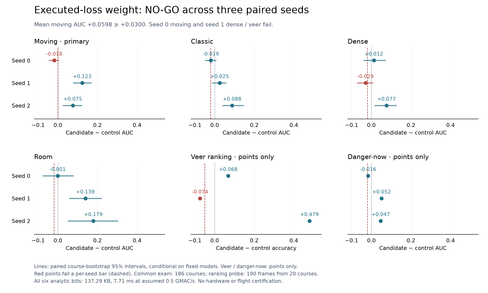

# executed_weight_v1 — NO-GO

Generated by `python -m eval.eval_executed_weight_report` from the
[raw report](records/report.json) and immutable individual receipts.
No new fitting, scoring, bootstrap or changed gate.

Six fresh 80-epoch fits share the same 192-course training corpus.
Only moving executed prediction/collision loss weight changes:
1.0 control versus 2.25 candidate, divided by the training partition's
mean raw weight. Batches, CF/now/variance recipes, splits and optimizer
step counts stay fixed. D64, four strips, 64px, one input frame.
All six score the same new 186-course exam (12,179 valid windows).

Moving mean AUC delta **+0.0598** passes the **+0.0300**
mean bar, but seed 0 fails the strictly-positive moving requirement.
Seed 1 also fails dense AUC and pooled veer guards. Therefore the
registered joint improvement test is **NO-GO**, despite the mean gain.
The default weight stays 1.0; no candidate is promoted.

## Primary: moving collision AUC@32

| Seed | Control | Candidate | Delta | Paired course-bootstrap 95% interval |
|---|---:|---:|---:|---:|
| 0 | 0.7687 | 0.7503 | -0.0184 | [-0.0424, +0.0027] |
| 1 | 0.6518 | 0.7745 | +0.1227 | [+0.0785, +0.1667] |
| 2 | 0.6517 | 0.7269 | +0.0752 | [+0.0279, +0.1200] |

Every moving AUC uses all 42 moving exam courses and both classes.
Intervals resample paired whole courses (2,000 draws, seed 0),
conditional on each fixed model pair. They are descriptive, not
gating or training-population confidence intervals. A good three-draw
mean cannot erase a failed per-seed criterion.

## Every guard, every seed

Candidate minus control. **Bold** fails the frozen guard.

| Seed | Classic AUC | Dense AUC | Room AUC | Danger-now AUC | Veer accuracy |
|---|---:|---:|---:|---:|---:|
| 0 | -0.0191 | +0.0123 | -0.0012 | -0.0165 | +0.0684 |
| 1 | +0.0252 | **-0.0293** | +0.1388 | +0.0517 | **-0.0737** |
| 2 | +0.0881 | +0.0766 | +0.1790 | +0.0471 | +0.4789 |

AUC guards require ≥−.02; the pooled veer guard requires ≥−.05.
Each veer reading uses **190 frames from 20 independent courses**:

| Probe world | Frames | Courses |
|---|---:|---:|
| classic | 43 | 7 |
| dense | 139 | 12 |
| moving | 8 | 1 |
| room | 0 | 0 |

The registered pooled support bar (20 frames / six courses) passes.
However, moving contributes only one probe course. The pre-existing
world-stratified bootstrap refuses an interval when a stratum has fewer
than two courses, so all three veer intervals remain **undefined**,
with the reason recorded. No interval was fabricated or exam expanded.
This limits ranking uncertainty; it does not change the separate
42-course moving AUC or the frozen pooled guard. Room geometry is
outside the pillar-kinematic veer probe. Danger-now has point estimates
only; no additional post-hoc bootstrap was introduced.

## What was weighted

The executed window counts are identical within each pair. Weight
mass changes; no extra windows or independent observations appear.

| Seed | Training windows | Normalizer | Moving weight share, control → candidate |
|---|---:|---:|---:|
| 0 | 6,893 | 1.222146 | 17.77% → 32.72% |
| 1 | 6,796 | 1.224948 | 18.00% → 33.06% |
| 2 | 6,753 | 1.224715 | 17.98% → 33.03% |

The coefficient changes both executed latent prediction and collision
objectives. It does not isolate either loss's contribution or restore
the older corpus's action/label support. Error magnitudes, derivatives
and Adam state prevent equating weight mass with gradient contribution.

## Embedded bill and endpoint limits

Every model has the same **137.29 KB** analytic int8 bill:
81.29 KB weights + 28 KB activations + 28 KB workspace.
3,856,768 MACs/decision estimate **7.71 ms** at assumed
0.5 GMAC/s. No hardware timing, quantization-parity test or flight gate.

| Arm | Seed | MSE@32 | Own no-op@32 | Std median | Std max | Mean abs latent |
|---|---:|---:|---:|---:|---:|---:|
| unit | 0 | 0.4682 | 0.9217 | 1.2522 | 1.6969 | 1.3446 |
| unit | 1 | 1.2386 | 2.4885 | 1.5482 | 2.6581 | 1.2783 |
| unit | 2 | 4.5338 | 6.3978 | 2.5691 | 6.5142 | 16.1382 |
| moving_2p25 | 0 | 0.5652 | 1.1201 | 1.3441 | 1.7987 | 1.5162 |
| moving_2p25 | 1 | 0.9225 | 1.5635 | 1.5598 | 3.1825 | 2.1436 |
| moving_2p25 | 2 | 0.7265 | 1.2203 | 1.4143 | 1.7235 | 1.4118 |

Every fit beats its own no-op MSE@32. These are internal-validation
endpoints on learned latent scales, not a certificate of exam decision
quality. Control seed 2's large absolute latent value accompanies
weak scores; that association does not establish a failure mechanism.
The mean moving gain motivates a hypothesis about objective allocation,
but this factor/recipe fails the required consistency and guards.
No seed selection, replacement, extra exam, altered bar or promotion.
